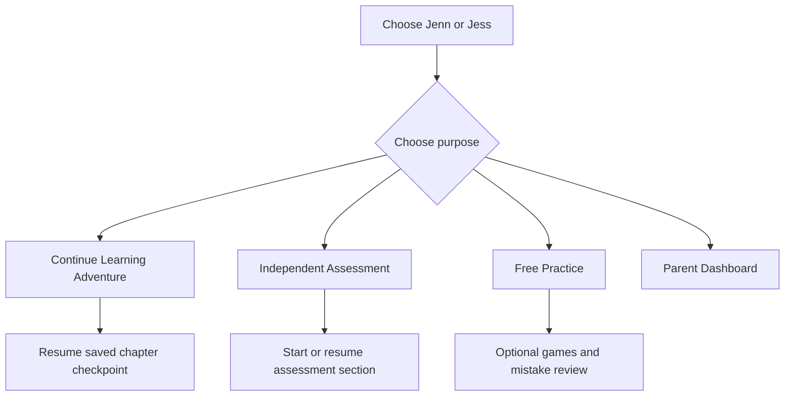

# French Adventure — Assessment-to-Learning Implementation Plan

**Repository:** `lxyzh1019-cyber/French-Adventure`  
**Baseline branch:** `main`  
**Baseline commit:** `f065ca89dbd771a4c396baf9b0081af2f31e8f77`  
**Prepared:** 2026-09-05  
**Revision:** 3 — 2026-09-09; M1 cleanup folded into M2 and single-document execution clarified  
**Status updated:** 2026-09-09; M1 code re-audit passed at `a8220ce`; combined cleanup-plus-M2 plan ready; actual-iPad acceptance pending  
**Primary users:** Jenn and Jess, Grade 5, Alberta regular public school (not French Immersion)  
**Primary device:** iPad  
**Expected use:** one or two 20-minute sessions per week

---

## 1. Purpose of this plan

Transform French Adventure from a grade-labelled vocabulary game into two clearly separated products inside one app:

1. **Independent Assessment** — a repeatable, low-support measurement of each child's current French abilities and progress.
2. **Learning Adventure** — a story-led learning system that teaches, supports practice, corrects mistakes, and checks retention later.

The learning goal is to advance beyond regular Alberta FSL schoolwork and progressively approach some of the **functional French-language abilities** developed in French Immersion. The app must never claim that an app level equals a French Immersion school grade.

This is an implementation plan, not authorization to begin coding. Before implementation, Claude must:

- read the repository and this entire plan;
- confirm the baseline commit;
- report any conflict between the current code and this plan;
- propose the files to change and the tests to add;
- wait for parent approval before making changes;
- complete and validate one approved milestone at a time;
- pass its internal work-package checks before advancing;
- request review at milestone boundaries, not after every internal task.

**Current readiness:** This is the only governing Claude-facing document. Release A (`assessment-v1.0.0`) has been authored, imported into the repository, and validated with both complete forms. The M1 re-audit of `a8220ce` confirms that the same-day concurrent-sync and delayed wrong-match blockers are repaired and the full automated code gate passes in CI. Claude may handle the remaining small cleanup as Step 0 of the same M2 branch and approval cycle; it is not a separate milestone or document. Actual-iPad evidence must still be recorded before M2 is accepted. Release B has not been authored or delivered.

Blue text marked “Updated” identifies the principal revised decisions. Colour may not render in every Markdown reader; the wording remains authoritative.

---

## 2. Confirmed product decisions

These decisions are settled and must not be reopened unless implementation evidence reveals a direct conflict.

| Decision | Requirement |
|---|---|
| School context | Regular Alberta FSL, not French Immersion |
| Long-term aim | Advance beyond school and progressively approach practical French-language abilities associated with immersion |
| Skill priority | Listening → Reading → Writing → Speaking, with pronunciation in every learning session |
| Assessment | Separate, repeatable, and excluded from game rewards and learning assistance |
| Session length | 20 minutes |
| Frequency | One or two sessions per week |
| Story | A fictional mystery integrated with the rise, global expansion, decline, and continuing legacy of French influence |
| Historical treatment | Include achievements and consequences of empire, including age-appropriate colonization, Indigenous perspectives, slavery, resistance, independence, and Francophone legacies |
| Learner structure | Shared story for Jenn and Jess; separate difficulty, progress, evidence, and assessment records |
| Main French variety | Canadian French (`fr-CA`) |
| Accent exposure | Introduce France and other Francophone accents gradually and label the speaker/region |
| Pronunciation technology | Test free iPad features first; Azure free-tier trial only if needed; paid usage only after explicit approval |
| Authentication | Deferred by parent decision; preserve current cross-device sync and do not add authentication to M1 or M2 unless the parent reopens the decision |
| Initial scope | Repair defects, build assessment, and validate one four-chapter pilot before expanding the curriculum |

---

## 3. Non-negotiable product principles

### 3.1 Activity is not mastery

The following must remain different concepts in code, data, and parent reports:

- `attempted`
- `completed`
- `correct with support`
- `correct independently`
- `mastered now`
- `retained after delay`
- `used in a new context`

A child must not receive mastery credit merely for finishing a game, revealing an answer, repeating the same item immediately, or being understood by speech-to-text.

### 3.2 Story serves learning

French must reveal evidence, enable choices, and solve the mystery. Do not place unrelated vocabulary quizzes between story paragraphs and call that story-based learning.

Every chapter must connect:

1. a story problem;
2. a communicative goal;
3. a small set of language targets;
4. guided practice;
5. an independent application;
6. delayed retrieval in a later session.

### 3.3 Support must fade

Support levels must be explicit:

| Level | Allowed support |
|---|---|
| 0 — Independent | No translation, hint, word bank, replay beyond the standard allowance, or correction before submission |
| 1 — Light | One French clue, slower replay, or visual support |
| 2 — Guided | Word bank, highlighted language pattern, or partial sentence |
| 3 — Modelled | Translation, complete example, reveal, or copy/repeat |

The app may celebrate learning at every level, but only Level 0 evidence can qualify for independent mastery.

### 3.4 Error is followed by teaching

In Learning Adventure, three errors must not end the lesson. They trigger a help sequence:

1. identify the likely error type;
2. show or replay one concise explanation/example;
3. provide a guided retry;
4. give a new but equivalent independent check later;
5. place the skill into delayed review if it remains weak.

Lives may remain in optional challenge games, but must not block core instruction.

### 3.5 Historical accuracy and perspective

- Separate documented history from fictional characters and clues.
- Add a visible label such as **Real History** or **Story Fiction** where confusion is possible.
- Do not describe empire only through rulers, explorers, or military victories.
- Include the experiences and agency of Indigenous peoples, colonized communities, enslaved people, settlers, traders, women, children, resistance movements, and later Francophone communities when relevant.
- Use age-appropriate language without hiding coercion or harm.
- Have historical content reviewed before release; do not generate it dynamically for children without review.

### 3.6 Privacy and child safety

- Do not embed service secrets in client-side code.
- Do not store raw child audio by default.
- For any future external pronunciation service, send only the short clip required for the current task.
- Obtain explicit parent opt-in before external audio submission.
- Show whether a recording remains on the device, is uploaded temporarily, or is saved.
- Provide a parent control to delete saved recordings and speech records.

---

## 4. Required application structure

The home flow must clearly separate the two purposes:



### Required distinctions

- **Learning Adventure:** teaching, hints, retries, story rewards, and planned review.
- **Assessment:** no teaching, no correctness feedback during a section, no game points, and unseen or securely rotated item forms.
- **Free Practice:** existing game styles may remain after repair, but results are practice evidence only.
- **Parent Dashboard:** shows skill-specific evidence, support use, retention, and history; it must not summarize everything as one grade.

---

## 5. Five implementation milestones and release governance

<span style="color:#1565C0">Updated: Five milestones govern the initial release. The detailed Phase 0–8 sections retained below are work-package references, not nine separate approval steps or additional plans. This section supersedes older phase-by-phase workflow wording.</span>

### 5.1 The five milestones

| Milestone | Claude's scope | Required input | Exit gate |
|---|---|---|---|
| M1 — Repair foundation | Work packages 0 and 1: baseline, recovery, tests, answer checking, scoring, resume, dates, sync | This master plan plus permission to implement M1 | Regression evidence, migration/recovery checks, basic iPad smoke test, parent acceptance |
| M2 — Cleanup + independent assessment | First close the listed M1 cleanup, then implement Release A scoring, routing, section resume, original-audio handling and reports in one branch/PR | M1 automated code gate passed; complete imported Release A | Cleanup and all Release A implementation checks pass; actual-iPad evidence recorded; parent accepts assessment flow |
| M3 — Learning pilot | Work packages 3 and 4: learning engine, review scheduling, complete four-chapter mystery | M2 accepted; complete approved Release B | Content integration and learning-engine tests pass; story and skill coverage verified |
| M4 — iPad validation | Work package 5 plus end-to-end touch, keyboard, audio, interruption, and sync checks | M3 working build and device checklist | Actual-device results and repairs; no critical device blocker; parent accepts free pronunciation experience |
| M5 — Evaluate and release pilot | Work package 6: family use, findings, repairs, release evidence | M4 accepted, baseline records, completed learner sessions | Review against pilot criteria; final release approval; explicitly scoped expansion decision |

Work package 7 (Azure) is an optional later experiment, not a prerequisite for M5. Work package 8 (curriculum expansion) is future scope, not part of the initial release promise. Neither starts automatically.

### 5.2 Exactly one master plan and two content releases

There is one governing Markdown plan: this file. Keep its filename and identity stable when updating it. The former separate M1 audit has been incorporated here and retired. Release packages are machine-readable app inputs, not competing plans or extra approval documents.

| Delivery | Owner | Release point | Current status |
|---|---|---|---|
| Master plan, revision 3 | ChatGPT | Now; governs all five milestones | Delivered; M1 cleanup and M2 consolidated into one execution path |
| Release A — Assessment Content | ChatGPT | Before M2 begins; may be authored while Claude implements M1 | Delivered and imported as `assessment-v1.0.0`; 90 items across complete A/B forms; one tier-band sentence needs correction before learner-facing scoring integration |
| Release B — Four-Chapter Learning Content | ChatGPT | Before M3 begins; may be drafted during M2 and adjusted using baseline evidence | Pending; existing chapter descriptions are outlines only |

These are dependency-based release points, not background delivery promises or calendar deadlines. ChatGPT and Claude work in their respective active sessions; the parent transfers released packages between them. No automatic handoff or unattended authoring is assumed.

“Complete question pools” means every assessment and learning item required for the agreed first release, including alternative answers, feedback, scoring, review variants, and required audio scripts. It does not mean an entire elementary-to-middle-school curriculum or every future historical arc.

### 5.3 Responsibility and decision authority

<span style="color:#1565C0">Updated: ChatGPT owns educational/content specifications and authoring. Claude owns implementation and technical verification. The parent owns product approval, actual family-device testing, and release decisions.</span>

| Area | ChatGPT | Claude | Parent |
|---|---|---|---|
| Curriculum and learning method | Research, map outcomes, define teaching/assessment rules | Implement; flag contradictions | Approve direction and material changes |
| Assessment bank | Author exact items, keys, distractors, rubrics, placement and comparison rules | Validate schema and integration; implement scoring exactly | Review learner-facing experience and unresolved choices |
| Story and learning bank | Author French content, narrative, history notes, practice, feedback and delayed checks | Integrate scenes, interactions, assets and approved content | Review age suitability and engagement |
| French and historical QA | Check sources, language, internal consistency; label unresolved uncertainty | Flag suspected errors; do not silently alter content | Decide whether unresolved material requires external review |
| Technical architecture | Review whether proposals satisfy learning/data requirements | Choose implementation details within scope; own code, migrations and recovery mechanics | Approve material scope or service changes |
| Testing | Define educational cases and review evidence | Write/run automated tests and available browser tests; repair failures | Perform actual iPad microphone/touch tests and report observations |
| Baseline and pilot review | Interpret domain evidence and recommend adjustments | Produce accurate reports and fix implementation issues | Supervise assessment conditions and provide learner observations |
| Release | Assess against requirements | Provide reproducible build and test evidence | Final acceptance |

AI review is not external educator certification. If specialist review has not occurred, do not label the content educator-validated or psychometrically validated. Open speaking/writing outcomes must remain unscored or awaiting rubric review when no trustworthy scorer is available; transcription must never substitute for those rubrics.

Claude may correct code freely within an approved milestone. Changes to prompts, accepted answers, curriculum mapping, mastery thresholds, assessment interpretation, story facts, or privacy/service decisions require a recorded proposal and approval. Formatting/import corrections that preserve content meaning can proceed with a recorded diff.

### 5.4 Release A contract — complete assessment content

Deliver one versioned package, `French_Adventure_Assessment_Content.zip`, containing:

| File | Required contents |
|---|---|
| `manifest.json` | Release ID/version, compatible master-plan revision, file list and hashes, exact item counts by form/domain/difficulty, validation status |
| `assessment_items.json` | Complete reviewed A/B forms; stable IDs; exact prompts, stimuli, choices, distractors, accepted answers, audio scripts, skill/outcome links, difficulty and exposure group |
| `assessment_rules.json` | Exact section order, entry/routing/stop rules, replay allowances, minimum evidence counts, scoring, invalid-item replacement and pause/resume rules |
| `rubrics.json` | Writing/speaking dimensions, anchored score descriptions, scored examples, scorer requirements and unresolved-review handling |
| `curriculum_map.json` | Outcome text/reference, official source and retrieval date, mapping rationale, coverage and enrichment labels |
| `scoring_fixtures.json` | Correct, partial, incorrect, supported and technically invalid response examples with expected scores/reports |
| `review_notes.md` | Content/source QA, limits, release compatibility, unresolved issues and concise installation instructions |

The approximate counts in work package 2 are planning ranges, not a completed bank. Release A must freeze exact totals and difficulty coverage before M2 starts. An A/B label alone does not establish equivalence: include the matching blueprint and acknowledge that actual comparability still needs pilot evidence.

Release A must also settle the currently unspecified adaptive routing and domain-band thresholds; Claude must not invent them. Define how repeat assessments select alternate forms, avoid exposed items, and report a ceiling/floor or insufficient evidence without inventing a school-grade result.

Listening scripts are mandatory. A reviewed playback source must exist for each listening item before assessment acceptance. Claude may implement audio generation/playback from the approved script and locale, but audio still requires listening QA. Assessment audio must not display its transcript or English translation during the item.

Release A passes only when every referenced item/skill/answer/rubric exists, both forms have complete coverage, scoring fixtures are consistent, and no placeholder or unresolved essential scoring decision remains. Authoring and automated checks do not by themselves prove assessment validity.

### 5.5 Release B contract — complete learning/story content

Deliver one versioned package, `French_Adventure_Pilot_Content.zip`, containing:

| File | Required contents |
|---|---|
| `manifest.json` | Release/version, master-plan compatibility, dependencies, exact chapter/activity totals and file hashes |
| `chapters.json` | All four complete chapter scripts, scene order, choices, consequences, convergence, recaps, safe bookmarks and fiction/history labels |
| `learning_items.json` | Exact teaching examples, guided tasks, independent exit checks, accepted answers, skill tags, explanations, misconception-specific feedback and retry variants |
| `review_items.json` | Different delayed-retrieval and transfer items, linked skills, due conditions and support variants |
| `skills.json` | Prerequisites, explicit mastery evidence requirements, difficulty/support variants, error categories and scheduling parameters |
| `pronunciation_tasks.json` | Model scripts, target features, child-friendly cues, recording instructions, fallback paths and honest feedback wording |
| `history_sources.json` | Claim-level sources, dates checked, fictional elements, perspectives and review status |
| `learning_fixtures.json` | Example learner histories and expected scheduling, feedback, mastery and story states |
| `review_notes.md` | Pilot coverage, French/history QA, audio/visual asset requirements, baseline adaptation rationale and limitations |

The package must contain actual child-facing content, not only an authoring template or instructions for Claude to fill it. Every target needs teaching, guided practice, independent checking, delayed review and transfer coverage. All branches and error paths need finished text and behaviour.

Start with the four-chapter scope in this plan. If baseline evidence shows the content is too easy or difficult, ChatGPT revises the support/difficulty variants and records the rationale before M3. If baseline results are not yet available, label any difficulty choice provisional and retain a review gate before learner use.

### 5.6 Content delivery, versioning and change control

Suggested repository destinations when Claude imports the released files:

- Master plan: `docs/French_Adventure_Improvement_Plan.md`.
- Content A: `content/releases/assessment-v1/`.
- Content B: `content/releases/pilot-v1/`.
- One repository execution log: `docs/implementation-status.md` (evidence only, not a second plan or instruction document).

The status record is an execution log, not another plan. It records milestone status, master-plan revision, content versions, implementation commit, passed/failed checks, manual tests still needed, and parent acceptance. Use `not_started`, `in_progress`, `ready_for_review`, `accepted`, or `blocked`; never equate “files created” with “accepted.”

Keep item IDs stable for cosmetic changes. Meaningful changes to an item or scoring rule require a new version, an affected-records note, and no silent rewrite of historical scores. Preserve the original response and scoring version.

For a material change: state the problem, proposed change, affected items/code, evidence and migration impact; obtain approval; then update this same plan or the relevant content package. Do not introduce a new competing master plan.

### 5.7 What Claude can do with this revision

- Once authorized, execute the combined M2 sequence in this document. Step 0 contains the remaining M1 cleanup; do not create a separate cleanup plan, milestone, PR or approval round.
- Use synthetic fixtures for technical tests, clearly marked test-only.
- Do not create production assessment/lesson pools, invent grade bands, or promote placeholders into child-facing content.
- If Release A or B is missing, report the specific missing dependency. Continue only unrelated work already authorized within the current milestone.
- A partial bank is a prototype, not completion of M2 or M3.
- At the end of M2, return one evidence-backed review summary. Its internal steps do not create extra plans or approval rounds unless a material decision or blocker requires parent input.

---

# Phase 0 — Baseline, architecture, and test harness

## 0.1 Preserve current data before changing schemas

- Document every current persisted field in Firebase and local storage.
- Export a recovery copy for both learner profiles.
- Add a numeric `schemaVersion`.
- Write explicit, idempotent migrations. Never use learner-name-specific migration patches in normal application logic.
- Do not delete current stars, moons, history, or mistake records. Store legacy values separately if they cannot map cleanly to the new model.

## 0.2 Refactor boundary

The current app is a single large `index.html`. Claude must propose a minimal module split before adding assessment and lesson engines. Recommended boundaries:

```text
index.html
src/
  app.js
  state/
    schema.js
    storage.js
    sync.js
    migrations.js
  content/
    curriculum-map.js
    assessment-items.js
    pilot-story.js
  learning/
    scheduler.js
    mastery.js
    feedback.js
  modes/
    assessment.js
    adventure.js
    practice.js
    parent.js
  speech/
    playback.js
    recorder.js
    recognizer.js
tests/
```

This is a recommended boundary, not permission for a broad rewrite. Preserve working UI where possible. If deployment constraints require a single generated file, source modules should remain maintainable and be bundled for deployment.

## 0.3 Establish tests before behavior changes

At minimum, add unit or integration coverage for:

- French text normalization;
- scramble item construction and answer checking;
- matching selection and delayed feedback;
- round resume and idempotent scoring;
- completion versus early termination;
- daily/session limits;
- skill evidence and support levels;
- mastery and delayed-review scheduling;
- date handling in `America/Edmonton`;
- cross-device merge behavior;
- assessment scoring and form separation.

## Phase 0 acceptance criteria

- [ ] Tests run with one documented command.
- [ ] Current persisted schema is documented.
- [ ] A recovery export exists for Jenn and Jess.
- [ ] `schemaVersion` and migration strategy are defined.
- [ ] Parent approves any proposed module split.
- [ ] No learner data is cleared or rewritten merely by opening the app.

---

# Phase 1 — Repair confirmed logic defects

These repairs precede new learning features because current results are not reliable.

## 1.1 Centralize French comparison rules

Create distinct utilities instead of using one accent-stripping comparison everywhere:

- `normalizeForRecognition(text)` — case and harmless spacing normalization for meaning/recognition tasks.
- `normalizeForSpelling(text)` — preserve letters, apostrophes, hyphens, accents, and `œ` when those are learning targets.
- `tokenizeFrench(text)` — safe handling for spaces, punctuation, elisions, and apostrophes.
- `escapeForDisplay(text)` — display through DOM text nodes or safe binding, not string-built inline JavaScript.

> **Implementation note (Claude, M2 Step 0).** The first two exist under these
> names in `src/util/fr-text.js`. The last two ship under different names:
> `tokenizeFrench` is `frTokenize` (`src/util/fr-text.js`), and
> `escapeForDisplay` is `escapeAttr` (`src/app.js`). The names were kept and
> this note added instead of renaming working code. Recorded in
> `docs/implementation-status.md`.

Do not silently treat `ou` and `où`, `a` and `à`, or `sur` and `sûr` as equivalent in spelling tasks. If accents are not being assessed at an early stage, record the response as **meaning correct, spelling needs correction**, rather than completely correct.

## 1.2 Repair Scramble

Current behavior removes characters from the tiles while comparing against the original target. Replace it with one of these deliberate item types:

1. **Word scramble:** every required grapheme/tile needed for the accepted answer is available.
2. **Phrase order:** tokenize the phrase into meaningful word/punctuation tiles.
3. **Spelling build:** keep apostrophe, hyphen, accent, and `œ` explicitly, with appropriate input support.

Do not use letter scramble for multiword phrases unless spaces/elisions are represented correctly.

Required regression cases:

- `sœur`
- `grand-mère`
- `arc-en-ciel`
- `aujourd'hui`
- `j'ai mangé`
- `ne...pas`
- `je t'en prie`

Every generated scramble must be automatically validated as solvable before it can appear.

## 1.3 Repair inline audio actions

- Remove inline `onclick` handlers containing interpolated French text.
- Bind click events with DOM APIs and pass the text as data.
- Test apostrophes, quotation marks, accents, and punctuation.
- Add cases for `j'ai`, `aujourd'hui`, `l'école`, and `s'il vous plaît`.

## 1.4 Repair Match resume

- Ensure restored `frWords` and `enWords` are available in every resume path.
- Rebind a saved selected tile safely.
- Do not resume a fully completed matching board.
- Confirm matched pairs are not counted twice.

## 1.5 Repair wrong-match delayed callback

- Capture the two button references locally before clearing selection state.
- A delayed visual reset must act only on those captured buttons.
- Rapid taps after an incorrect match must not modify a newer selection or throw an error.

## 1.6 Make scoring idempotent on resume

Add a stable `attemptId` and `questionInstanceId`.

- An answer event can be committed once only.
- If feedback was open when a draft was saved, resume at the feedback state or advance safely; do not allow the same response to score again.
- Leaving during a round and reopening it must preserve both the response and its committed status.

## 1.7 Separate completed and terminated rounds

Replace the single completion path with explicit outcomes:

- `completed`
- `abandoned`
- `interrupted`
- `challengeFailed`
- `timedOut`

Only `completed` counts toward format completion. In Learning Adventure, errors must not produce `challengeFailed`; they invoke support.

## 1.8 Correct time and date behavior

- Use the IANA zone `America/Edmonton` for day keys, weekly boundaries, gates, reports, and backups.
- Do not use device-local time or UTC slicing as the definition of the family day.
- Store event timestamps in UTC plus the derived Edmonton date key.
- Test Edmonton midnight, Sunday/Monday rollover, daylight-saving transitions, and devices with an incorrect local timezone.

## 1.9 Prevent whole-profile overwrite during sync

Do not resolve concurrent activity by choosing the profile with a later device timestamp or a “richer” score.

Recommended model:

- immutable attempt/event records with unique IDs;
- deterministic aggregation into current progress;
- server timestamp for ordering where needed;
- idempotent writes;
- per-learner/per-session documents rather than replacing the whole profile;
- explicit conflict handling for mutable settings.

At minimum, prove with a test that one iPad's offline completion and another device's completion both survive reconnection.

## Phase 1 acceptance criteria

- [ ] All seven required scramble cases are solvable and correctly checked.
- [ ] No French apostrophe or accent breaks an audio control.
- [ ] Matching can resume before selection, after one selection, after several pairs, and after interruption.
- [ ] Rapid wrong matching produces no exception and does not reset a newer selection.
- [ ] An answered question never awards points or evidence twice after resume.
- [ ] Running out of challenge lives is not recorded as completing all questions.
- [ ] Edmonton date tests pass.
- [ ] Concurrent offline attempts from two devices both survive sync.
- [ ] Existing learner data remains recoverable.

---

# Phase 2 — Independent Assessment

## 2.0 Combined M2 execution sequence

This is **one milestone, one Claude branch/PR, and one parent review**. The seven rows below are internal implementation steps, not separate plans or approval gates. Claude should commit by step so failures can be isolated, but continue through the sequence unless a material conflict requires a parent decision.

| Step | Claude action | Completion evidence |
|---:|---|---|
| 0 | Close the small re-audit cleanup listed below | Focused regressions plus full `npm run verify:all` |
| 1 | Add the separate, versioned assessment attempt/response model | Migration and merge tests; practice records unchanged |
| 2 | Build assessment entry, form assignment, section navigation, autosave and cross-device resume | A/B determinism and interruption/resume browser tests |
| 3 | Implement listening, reading, and vocabulary/grammar from all Release A objective items | Routing, replay, invalid/support, no-hint and no-reward tests |
| 4 | Implement writing and speaking capture, including locally retained original audio | Permission-denial, interruption, replay and `awaiting_review` tests |
| 5 | Implement domain scoring, parent review, reports and reassessment comparison | Every scoring fixture plus report snapshot/logic tests |
| 6 | Run the full technical suite and provide the actual-iPad handoff checklist | CI pass, no data regression, device results, one M2 review summary |

### Step 0 — cleanup folded into M2

Complete these in the same M2 branch before learner-facing assessment integration:

1. Remove the duplicate `verify`, `deploy`, `test:browser`, and `verify:all` keys from `package.json`.
2. Update stale repository statements: CI is no longer pending; Release A exists; the two former M1 blockers are fixed; current automated counts are 147 unit tests and 26 browser tests at the audited commit.
3. Change cloud-backup restoration to run restored data through `migrateProfile()` before saving, and add a v1-backup regression. The combined file-import path already migrates safely.
4. Correct Release A's tier-band sentence to: **“The domain band is the highest administered tier observed at emerging or secure, labelled with that tier's status.”** Keep fixture `FX-STRETCH` and the existing `stretch_emerging` behavior.
5. Put the secure and emerging thresholds into explicit numeric Release A rule fields and have the scoring module read them. For `assessment-v1.0.0`, the values remain 0.75 and 0.50.
6. Run `npm run verify:all`. No cleanup item is complete merely because documentation changed.

The actual family-iPad M1 checklist may run in parallel with Steps 0–5. Any data-loss, resume, microphone, or speech failure found on the device becomes a blocking defect in this same M2 branch. M2 cannot be accepted until those device results are recorded.

## 2.1 Assessment purpose and reporting

The assessment must report a **profile**, not one grade:

| Domain | Report separately |
|---|---|
| Listening | Word/phrase recognition, main idea, details, directions |
| Reading | Word/phrase recognition, sentence comprehension, short-text comprehension, inference when appropriate |
| Writing | Spelling/encoding, sentence construction, short independent message |
| Vocabulary and grammar | Receptive knowledge and productive use in context |
| Speaking | Comprehensibility and ability to produce the requested message |
| Pronunciation | Device-assisted observations only; clearly label confidence and limitations |

The parent report must show:

- current demonstrated band per domain;
- evidence count;
- item difficulty range;
- independent versus unsupported/invalid attempts;
- strengths;
- specific next learning needs;
- comparison with the learner's own earlier assessment;
- no statement that the learner “is in French Immersion Grade X.”

## 2.2 Alberta curriculum mapping

Release A already contains the first traceable curriculum map. During implementation:

1. Preserve the cited official Alberta FSL Nine-Year Program source and date checked.
2. Preserve the mapping into the official program components: experience/communication, language, culture, and language-learning strategies.
3. Keep each item's outcome and skill references traceable through the supplied curriculum matrix.
4. Separately reference French Immersion language abilities only as a long-term enrichment benchmark.
5. Have a knowledgeable French educator review the mapping and French content where practical.

Do not infer curriculum alignment from a topic label such as “weather” or “reading.”

## 2.3 Release A assessment structure

Design for multiple sittings. A child may stop after a completed section and resume later.

The imported Release A package fixes the following counts for each parallel form:

| Section | Approx. time | Items per form | Notes |
|---|---:|---:|---|
| Listening | 8–10 min | 12 | No visible French text for pure listening items |
| Reading | 8–10 min | 12 | Includes connected-text comprehension |
| Vocabulary/grammar | 6–8 min | 10 | Recognition and production in context |
| Writing | 8–10 min | 6 | Includes independent production; human review required |
| Speaking/pronunciation sample | 6–8 min | 5 | Original audio retained locally; human review required |

Each form therefore contains 45 items; the release contains 90. Adaptive routing means a learner may not see every objective item. Counts and timing remain pilot settings requiring Jenn/Jess evidence; any later change requires a new content version.

## 2.4 Assessment rules

- Assessment items must be different from recently taught examples.
- Do not show correctness feedback until the section ends.
- Do not allow hints, word banks, translations, or unlimited replay.
- Allow a standard replay rule for listening, such as two plays; record replay count.
- Disable speed bonuses, lives, stars, moons, and leaderboards.
- Store every response, item version, response time, replay count, support/technical flags, and scoring rule version.
- A microphone failure or app interruption must mark an item invalid, not incorrect.
- Parent may invalidate an interrupted assessment attempt without deleting its audit record.

## 2.5 Parallel assessment forms

Create at least two comparable forms, A and B:

- similar outcome coverage;
- similar difficulty distribution;
- different surface words, sentences, and story context;
- alternate forms on reassessment;
- prevent direct reuse of recently practised items as progress evidence.

Do not generate assessment items at runtime. Items and scoring keys must be reviewed and versioned.

## 2.6 Scoring rules

- For each administered tier with at least three independent valid items, `secure` means at least 0.75 and `emerging` means at least 0.50 but below 0.75. Store these as numeric versioned rule fields; do not parse prose.
- The domain band is the highest administered tier observed at emerging or secure, labelled with that tier's status. Thus developing secure plus stretch emerging reports `stretch_emerging`.
- Report domain results separately.
- Require a minimum evidence count before assigning a domain band.
- Do not average a missing domain into a total.
- Store raw score, evidence count, confidence label, and interpretation separately.
- For open writing and speaking, use a small analytic rubric rather than correct/incorrect only.
- Preserve original responses so scoring changes can be audited.

Recommended rubric dimensions:

| Writing | Speaking |
|---|---|
| Message completed | Message completed |
| Vocabulary appropriate | Comprehensibility |
| Sentence structure | Vocabulary/structure |
| Spelling/conventions | Fluency appropriate to level |
| Independence | Pronunciation observation |

## Phase 2 acceptance criteria

- [ ] Step 0 cleanup is complete; duplicate script warnings and stale status statements are gone.
- [ ] Cloud backup and combined-file recovery both migrate v1 records safely.
- [ ] Assessment and practice use separate routes, state, scoring, and reports.
- [ ] No assistance or reward system leaks into assessment.
- [ ] At least two reviewed item forms exist for every implemented section.
- [ ] Listening contains items without written French clues.
- [ ] Reading contains connected text comprehension.
- [ ] Writing includes independent production.
- [ ] Speaking preserves original audio locally for qualified human review; a transcript is observation only and never determines pronunciation or fluency.
- [ ] Interrupted or technically invalid responses are not scored as wrong.
- [ ] Jenn and Jess can pause between sections and resume on another device.
- [ ] Parent report shows domain evidence and uncertainty without false grade equivalence.
- [ ] All 90 Release A items, both forms, every rubric, and every scoring fixture remain valid and traceable.
- [ ] The actual-iPad data, resume, microphone, audio and installed-voice results are recorded.

---

# Phase 3 — Learning and mastery engine

## 3.1 Skill model

Every teachable target needs a stable ID and metadata. Do not use a French word string as the only identity.

Example skill families:

- lexical meaning;
- listening discrimination;
- sound–spelling relationship;
- sentence pattern;
- grammatical choice;
- reading strategy;
- writing function;
- communicative function;
- cultural/historical understanding.

Each skill must define:

- prerequisite skills;
- receptive and productive forms;
- acceptable answers;
- common errors;
- feedback examples;
- relevant curriculum outcomes;
- story uses;
- review interval state.

## 3.2 Evidence record

Store one immutable evidence record per meaningful response:

```js
{
  evidenceId,
  learnerId,
  sessionId,
  activityId,
  skillIds,
  mode,                 // assessment | lesson | practice | challenge
  responseType,         // choice | typed | arranged | spoken | action
  result,               // correct | partial | incorrect | invalid
  supportLevel,         // 0..3
  attemptNumber,
  occurredAtUtc,
  edmontonDateKey,
  contentVersion,
  scoringVersion,
  deviceId,
  metadata
}
```

Do not award a correct result to every vocabulary token in a sentence merely because the whole sentence was arranged correctly. Conversely, a word-order mistake must not mark every word as unknown. Attribute evidence only to skills actually tested.

## 3.3 Mastery states

Use understandable states rather than permanent stars:

| State | Meaning |
|---|---|
| New | Not yet taught |
| Learning | Can respond with modelling or guidance |
| Practising | Some independent success, not yet stable |
| Ready to check | Enough practice for an independent check |
| Remembered | Passed a delayed independent check |
| Transfer shown | Used independently in a new context |
| Needs review | Later evidence shows weakness |

Mastery can rise or fall as new evidence arrives. Retain stars and moons as visual rewards, but derive learning claims from evidence states.

## 3.4 Review scheduler

Start with a transparent rule-based scheduler that can be tested:

- new learning: guided practice in the current session;
- first independent check: later in the same session using a different item;
- first delayed check: next scheduled session or at least 48 hours later;
- subsequent review: expand interval after independent success;
- return earlier after independent failure;
- do not count two immediate repetitions as retention.

The schedule must adapt to one or two weekly sessions. It must never require consecutive calendar-day use.

## 3.5 Learning success rules

Initial pilot rules:

- Lesson completion: all required steps attempted and story checkpoint saved.
- Independent checkpoint: approximately 80% success **and** minimum evidence per required skill.
- Remembered: passes a different delayed check at least 48 hours later.
- Transfer: uses the target in a different story situation without direct modelling.
- Excellence: optional 95% badge, never required to access core instruction.

The 80% and 95% values are pilot settings. Keep them configurable and review them using observed learner data; do not present them as universal scientific thresholds.

## 3.6 Feedback cycle

Feedback must match the error type:

| Error | Feedback action |
|---|---|
| Meaning confusion | Contrast the two meanings using a visual or short example |
| Listening confusion | Replay contrastively and direct attention to the distinguishing sound |
| Word order | Show the relevant sentence frame and compare positions |
| Gender/article | Highlight noun plus article as one learned unit |
| Verb form | Return to subject–verb pattern with one worked example |
| Spelling/accent | Mark the exact grapheme; preserve meaning credit where appropriate |
| Pronunciation | Let the child hear model and self-recording; identify one target only |

After feedback, use a new equivalent item. Do not immediately ask the identical item and count it as mastery.

## 3.7 Twenty-minute session controller

Target structure:

| Time | Function |
|---:|---|
| 3 min | Delayed retrieval and chapter recap |
| 4 min | New story scene through listening and reading |
| 4 min | Explicit instruction and guided practice |
| 5 min | Meaningful application to solve part of the mystery |
| 3 min | Pronunciation listen–record–compare–retry |
| 1 min | Independent exit check and bookmark |

Requirements:

- This is a pacing target, not six rigid screens.
- Warn at 17 minutes and create a safe stopping point.
- At 20 minutes, save a bookmark and offer to stop; do not erase progress.
- A parent may extend the session.
- Do not begin a long mandatory activity when fewer than two minutes remain.
- Resume at the exact story and learning checkpoint on another date/device.

## Phase 3 acceptance criteria

- [ ] Support use is recorded and affects interpretation.
- [ ] Immediate repeated success cannot become “Remembered.”
- [ ] A sentence error updates only the skills tested by that item.
- [ ] A later failure can move a skill to `Needs review`.
- [ ] Scheduler works for both one-session and two-session weeks.
- [ ] No core gate requires consecutive days.
- [ ] The session stops or bookmarks cleanly near 20 minutes.
- [ ] Parent report distinguishes lesson completion, current success, delayed retention, and transfer.

---

# Phase 4 — Four-chapter pilot: *The Missing Pages of the Atlas*

## 4.1 Story premise

A mysterious atlas contains four missing pages. Each page holds clues about how French political and cultural influence travelled across the world, why control was contested and lost, and why French language and cultures continued in many places afterward.

Jenn and Jess follow the same mystery through separate learner profiles. Their choices may change the order in which clues are examined, but must not create unreviewed alternate historical facts.

### Recurring fictional elements

- A curious companion who sometimes makes plausible but incorrect assumptions.
- A present-day archive or museum as the story hub.
- Letters, maps, diary fragments, object labels, recorded voices, and coded messages.
- A case board that separates **Known**, **Possible**, and **Not Yet Proven**.
- A clear badge distinguishing **Real History** from **Story Fiction**.

## 4.2 Pilot historical scope

The four chapters should introduce the larger arc without trying to teach the entire history of France in four sessions.

| Chapter | Historical lens | Mystery task | Core language function |
|---|---|---|---|
| 1. The Torn Map | France, exploration, trade, settlement, and alliances in North America | Identify where a missing page was sent and who handled it | Identify, locate, describe |
| 2. Two Accounts | New France and relationships/conflicts involving Indigenous peoples; competing perspectives | Compare two accounts and find what each leaves out | Compare, agree/disagree, cite a clue |
| 3. The Broken Seal | War, imperial rivalry, conquest/loss, and changing control; age-appropriate introduction to coercion and slavery where relevant | Reconstruct the order of events from messages and objects | Sequence past events and explain cause |
| 4. The Language That Remained | Resistance, independence, migration, and continuing Francophone communities including Canada | Decide why the atlas page survived after political control changed | Explain consequence, legacy, and identity |

The exact locations, dates, people, and objects must be chosen during researched content design and cited in the internal authoring notes.

## 4.3 Language scope for the pilot

Do not organize chapters by a long vocabulary list. Each chapter should introduce approximately:

- 4–6 high-utility words or chunks;
- 1 central sentence pattern or communicative function;
- 1 listening focus;
- 1 reading strategy;
- 1 short writing action;
- 1 pronunciation feature;
- planned retrieval of earlier targets.

Difficulty must adapt through support, sentence length, audio speed, response demand, and text complexity—not by changing the historical truth.

## 4.4 Story task examples

- Hear `Le document est sous la carte` and move the document correctly.
- Read two short witness descriptions and choose which clue both support.
- Complete and later independently produce a message such as `Je pense que... parce que...`.
- Put three event cards in sequence using `d'abord`, `ensuite`, and `enfin` when the learner is ready.
- Record a short line required to open an audio clue, while allowing a non-speech path if the microphone fails.
- Correct the companion's mistaken conclusion using evidence.

## 4.5 Branching rules

- Branches may change clue order, companion dialogue, or optional evidence.
- Required learning evidence must remain equivalent across branches.
- A wrong choice must lead to investigation and feedback, not a dead end.
- Historical events cannot change based on learner choice.
- Every branch must converge at a safe session bookmark.

## 4.6 Chapter authoring template

Every chapter content file must include:

```yaml
chapter_id:
title:
story_summary:
historical_scope:
real_history_sources:
fictional_elements:
curriculum_outcomes:
prerequisite_skills:
target_skills:
review_skills:
new_words_or_chunks:
sentence_pattern:
listening_focus:
reading_strategy:
writing_task:
speaking_task:
pronunciation_focus:
support_variants:
independent_exit_check:
delayed_check_in_later_chapter:
common_errors_and_feedback:
session_bookmarks:
```

## Phase 4 acceptance criteria

- [ ] Four chapters form one coherent mystery with a satisfying pilot resolution.
- [ ] Every French activity changes what the learner understands or does in the story.
- [ ] Each chapter has a manageable, explicit language scope.
- [ ] Every new target receives teaching, guided practice, independent application, and later retrieval.
- [ ] Historical facts have reviewed sources in authoring notes.
- [ ] Fiction and history are distinguishable to a 10-year-old.
- [ ] The story includes multiple perspectives and does not celebrate conquest uncritically.
- [ ] Jenn and Jess can follow the same plot at different support levels.
- [ ] No branch creates a dead end or changes historical facts.

---

# Phase 5 — Free iPad pronunciation pilot

This phase comes before Azure.

## 5.1 Free capabilities to implement and test

1. Play a reviewed Canadian French model recording or device voice.
2. Record a short child utterance through the iPad microphone.
3. Replay the child's recording immediately.
4. Allow model/self alternating playback.
5. Use built-in speech recognition, where available, to display **“The device heard…”**.
6. Never label a matching transcript as “perfect pronunciation.”
7. Allow the learner to retry without losing a life.

Prefer reviewed human recordings for the pilot's limited target set if feasible. If device text-to-speech is used, verify the actual selected voice and locale; requesting `fr-CA` does not guarantee that every device has the same voice installed.

## 5.2 Pronunciation teaching sequence

For each chapter, select one feature that matters for comprehensibility. The activity should:

1. establish meaning;
2. play the full word/phrase naturally;
3. optionally isolate the target contrast;
4. let the learner record;
5. let the learner compare model and self;
6. provide one child-friendly cue;
7. record a second attempt;
8. use the word or phrase meaningfully in the story.

Do not introduce phonetic notation unless a reviewed child-friendly explanation supports it.

## 5.3 Actual-device test matrix

Run on each iPad the family expects to use:

| Test | Required result |
|---|---|
| Safari permission prompt | Clear explanation; denial does not block the story |
| Add-to-home-screen/PWA if used | Recording and playback behavior documented |
| First recording | Starts and stops visibly; no accidental long recording |
| Playback | Model and self are distinguishable and audible |
| Recognition | Works where supported; failure is described neutrally |
| Headphones/no headphones | No feedback loop or unusable volume |
| Quiet/noisy room | Limitations visible; noisy result not treated as child failure |
| Interrupted session | Recording state recovers safely |
| Privacy | Raw audio deletion behavior verified |

For each device record iPad model, iPadOS version, browser/PWA mode, result, and issue.

## 5.4 Free-pilot decision gate

After testing, answer:

- Can the child reliably hear, record, and compare?
- Does built-in recognition provide useful encouragement without misleading scoring?
- Can a parent understand what needs work from the available evidence?
- Does the activity fit within three minutes?
- Are technical failures rare enough not to frustrate learning?

If yes, keep the free implementation. Azure is unnecessary for the pilot.

## Phase 5 acceptance criteria

- [ ] Tested on the family's actual iPads.
- [ ] Recording permission denial has a complete non-microphone path.
- [ ] Child can alternate model and self playback.
- [ ] Recognition output says what the device heard, not how good pronunciation was.
- [ ] No external speech service is called.
- [ ] No raw child audio is retained by default.
- [ ] Parent approves usefulness before any Azure work.

---

# Phase 6 — Family pilot and validation

## 6.1 Pilot procedure

1. Run the independent baseline assessment for Jenn and Jess.
2. Complete all four pilot chapters at the normal schedule.
3. Permit chapters to span sessions; do not rush to finish within one day.
4. Collect unobtrusive product evidence.
5. Reassess with the alternate form after approximately 8–12 completed sessions, or later if insufficient target material has been learned.
6. Conduct a short parent-and-child review.

## 6.2 What to measure

### Learning evidence

- independent listening and reading accuracy;
- delayed retention by skill;
- ability to use target language in a changed context;
- writing quality and independence;
- pronunciation retry behavior and parent observation;
- support level needed over time.

### Flow evidence

- actual session duration;
- where either child stops or asks for help;
- repeated taps, accidental exits, and resume failures;
- excessive audio replay;
- activities skipped or avoided;
- whether the child understands the story after a week away.

### Engagement evidence

- voluntary return or willingness to continue;
- ability to explain the mystery in her own words;
- meaningful story choices remembered later;
- preference for story, teaching, pronunciation, or optional games.

Do not use time in app, taps, stars, or chapter completion alone as evidence of learning.

## 6.3 Pilot success criteria

The pilot can expand only if:

- both children can resume after a week without losing the story thread;
- the majority of targeted skills have usable delayed evidence;
- the app identifies different needs for Jenn and Jess where their evidence differs;
- sessions normally fit 18–22 minutes or create a clean earlier bookmark;
- no critical save, resume, scoring, or iPad audio defect remains;
- parent reports are understandable without inspecting raw data;
- the historical treatment is accurate, balanced, and age-appropriate;
- both children can identify at least one thing learned and one thing still needing work;
- story engagement does not depend mainly on points or speed.

Failure of a criterion leads to pilot revision, not automatic content expansion.

---

# Phase 7 — Optional Azure pronunciation experiment

Do not start this phase automatically.

## 7.1 Entry conditions

Azure may be investigated only if:

- free recording/replay was tested successfully;
- built-in recognition is insufficient for the agreed feedback goal;
- the parent wants more detailed machine feedback;
- privacy flow and backend architecture are approved;
- current free-tier availability and regional pricing are rechecked;
- a monthly budget/cap is set explicitly.

## 7.2 Architecture requirements

- Azure credentials remain server-side.
- Client requests a short-lived app operation; it never receives the service key.
- Only short, prompted clips are submitted.
- Audio is not stored after scoring unless parent explicitly enables storage.
- Record service locale, assessment version, technical confidence, and failure state.
- Provide a full fallback when the service is unavailable.

## 7.3 Evaluation design

Use a small reviewed set of Canadian French words and short phrases. Compare:

- child recording and parent observation;
- built-in recognition result;
- Azure result;
- whether the feedback leads to an audible/useful second attempt;
- false rejection and false praise rate;
- response time and child frustration.

Do not expose a detailed numeric score to the children by default. Prefer one actionable cue. Azure results must not become a required story gate.

## Phase 7 acceptance criteria

- [ ] Parent explicitly approved the experiment and cost cap.
- [ ] No credential is shipped to the browser.
- [ ] Canadian French prompts are supported and validated.
- [ ] Technical failure never counts as poor pronunciation.
- [ ] Machine feedback is more useful than free record/replay for this family.
- [ ] Parent approves continued use before paid operation.

---

# Phase 8 — Expansion after validation

Expand by communicative ability and story arc, not by duplicating vocabulary to meet a numeric grade target.

## 8.1 Curriculum roadmap

For every proposed unit:

- identify Alberta FSL outcomes;
- identify prerequisites from the learner model;
- define listening, reading, writing, and speaking evidence;
- define the historical/cultural story purpose;
- define new versus review language;
- author parallel independent checks;
- validate French and history;
- test expected session length.

## 8.2 Content quality minimums

- Connected listening and reading must grow in length and complexity.
- Productive tasks must progress from supported completion to original messages.
- The same exact sentence cannot be duplicated to manufacture content volume.
- Vocabulary must be taught in chunks, sentences, and communicative contexts.
- Francophone culture must not be reduced to flags, food, famous people, or France alone.
- Learners should encounter multiple reviewed Francophone voices over time.

---

## 9. Data and reporting requirements

### 9.1 Separate data collections

Recommended conceptual collections:

```text
learners/{learnerId}
learnerSettings/{learnerId}
sessions/{sessionId}
attemptEvents/{evidenceId}
skillStates/{learnerId_skillId}
storyProgress/{learnerId_storyId}
assessmentRuns/{assessmentRunId}
assessmentResponses/{responseId}
contentVersions/{contentVersion}
```

Final database structure may differ, but it must support append-only evidence, independent assessment history, content versions, and conflict-safe sync.

### 9.2 Parent dashboard questions

The dashboard must answer:

1. What did the child work on?
2. What can she currently do independently?
3. What did she remember from an earlier session?
4. Where did she need support?
5. What kind of error occurred?
6. What will the app review next?
7. How has each domain changed since the last assessment?
8. Were any results technically invalid or low-confidence?

### 9.3 Child-facing progress

Show two parallel progress systems:

- **Adventure progress:** pages recovered, clues found, chapters completed.
- **Learning progress:** New → Learning → Practising → Remembered → Transfer shown.

Never take away story collectibles because a skill later needs review. A learning state may change without erasing accomplishments.

---

## 10. Existing feature disposition

| Existing feature | Disposition |
|---|---|
| Quick Quiz | Keep in Free Practice after repair; add productive variants over time |
| Word Match | Keep after resume/callback repair; practice evidence only |
| Scramble | Redesign into explicit word/phrase/spelling types |
| Sentence Builder | Keep as guided practice; do not treat word-bank success as independent writing |
| Listen & Speak | Split into listening dictation and pronunciation practice; stop conflating transcription with pronunciation |
| Boss Round | Keep as optional challenge after lesson targets are stable |
| Stars/moons | Keep as rewards; remove as proficiency evidence |
| Lives | Keep for optional challenges; replace with support triggers in lessons |
| Speed bonus | Familiar-material fluency games only |
| Mistake list | Replace with skill/evidence-based review scheduler |
| Daily Study | Replace with the current lesson/review queue, not random duplicated cards |
| Daily round cap | Apply to repeatable reward games only |
| Consecutive-day gate | Remove; use delayed checks on separate study dates |
| Grade lock | Replace with learner-path recommendations; parent can inspect all content |
| Leaderboard | Keep optional and based on adventure/practice points, never assessment or mastery |
| Parent summary | Rebuild around skills, support, retention, and domains |

---

## 11. Required automated and manual test scenarios

### 11.1 Automated

- Every authored activity validates against its schema.
- Every scramble can be solved from supplied tiles.
- Every accepted answer is reachable through the UI.
- Every audio/playback string handles apostrophes and accents.
- Duplicate answer submission is idempotent.
- Resume works at every activity state.
- Review scheduling is deterministic for fixed evidence.
- Assessment Form A and B have no accidental duplicate item IDs or answer leakage.
- Support Level 3 success cannot become independent mastery.
- Technical speech failure creates `invalid`, not `incorrect`.
- Edmonton date keys are stable across device timezone changes.
- Offline event merge retains both devices' evidence.

### 11.2 Manual iPad

- Portrait and landscape layout.
- Safari refresh and tab eviction.
- Add-to-home-screen mode if supported.
- Touch targets and accidental double taps.
- Keyboard opening/closing in writing tasks.
- French accents and apostrophes through the iPad keyboard.
- Audio autoplay restrictions.
- Microphone permission allow/deny/re-enable.
- Recording while using speakers and headphones.
- Resume after screen lock or app switch.
- Session continuation after a week and on another device.

---

## 12. Work discipline for Claude

For every milestone, Claude must provide before coding:

1. exact scope;
2. files to change;
3. data migration impact;
4. tests to add;
5. assumptions and unresolved risks;
6. what will remain deliberately unchanged.

After coding, Claude must provide:

1. changed files and purpose;
2. automated test results;
3. manual test checklist and results;
4. screenshots or short screen recordings for changed flows when useful;
5. known limitations;
6. data migration/recovery status;
7. milestone acceptance checklist including its internal work-package checks;
8. request for approval before the next milestone.

Claude must not:

- expand beyond the approved milestone;
- silently revise confirmed product decisions;
- claim curriculum alignment without a traceable mapping;
- claim pronunciation quality from speech-to-text transcription;
- classify random repeated questions as spaced repetition;
- duplicate content to satisfy artificial volume targets;
- overwrite or clear learner progress without explicit approval and recovery;
- place paid service keys in the browser;
- start Azure work before the free iPad pilot is reviewed.

---

## 13. Recommended first implementation milestone

The first approved coding milestone should include only:

1. Phase 0 baseline/tests/schema preparation;
2. Phase 1 defect repairs;
3. a short manual iPad regression checklist.

Do **not** build assessment or story content in the same milestone. Reliable scoring, resume, date handling, and sync are prerequisites for trustworthy assessment and learning records.

While Claude implements M1, ChatGPT may author Release A in a separate active session. After M1 is accepted and the complete Release A is delivered and approved, Claude begins M2. A small section may be prototyped first within M2 to verify delivery and scoring, but the content bank must already be supplied; Claude does not author the remaining production questions.

---

## 14. Definition of project success

French Adventure succeeds when:

- Jenn and Jess can use it independently for a focused 20-minute session;
- it teaches before it judges;
- it can show what each child understands and produces independently;
- it remembers mistakes and returns to them after a meaningful delay;
- French is necessary to investigate a compelling, historically responsible mystery;
- each child can follow the same story at her own learning level;
- pronunciation practice provides honest, useful feedback on iPad;
- assessment results are separate, repeatable, and comparable over time;
- progress survives interruptions and multiple devices;
- parents can understand learning progress without interpreting game points;
- content expansion follows demonstrated learning and engagement, not assumed grade labels.
